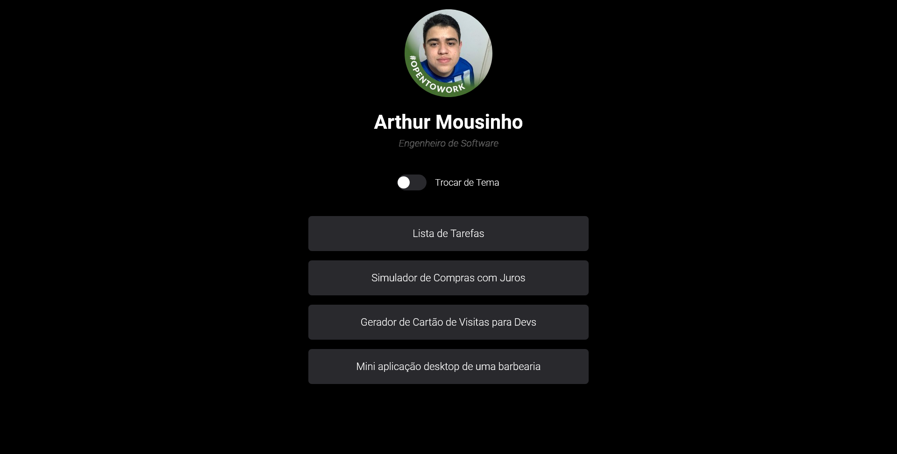
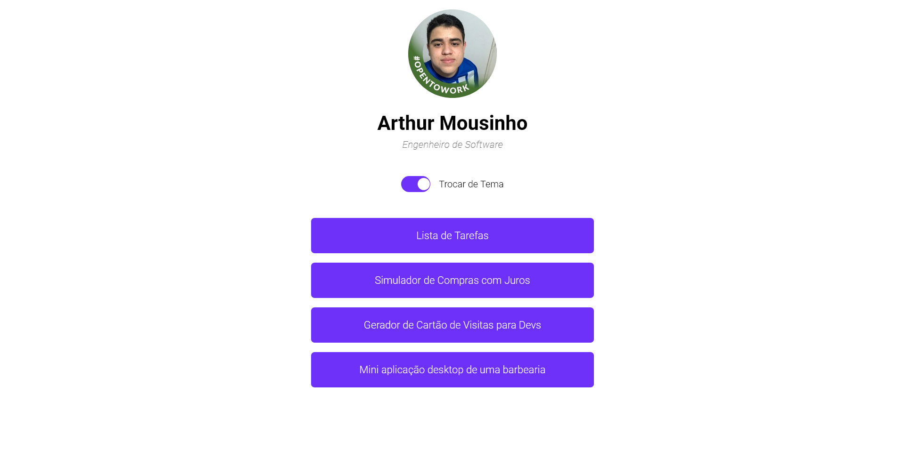

# Dev Links

- Projeto desenvolvido com os conhecimento do curso Dev Links da [Rocketseat](https://www.rocketseat.com.br/)
- Foi desenvolvido um agregador de links online

## 🚀 Modificações 

- Adaptei o design inicial da aplicação para praticar os conceitos aprendidos.
- Adicionei links de projetos já desenvolvi.
- Usei o [Design System da RocketSeat](https://www.youtube.com/watch?v=90y5707fJbI) como inspiração para a modificação do layout inicial do projeto.

## 🛠️ Stack utilizada
- HTML 
- CSS
- JAVASCRIPT

## 📚 Aprendizados
- Conhecimentos sobre a construção de layouts com HTML semântico.
- Dicas de responsividade, animações, variáveis e posicionamento de elementos com CSS.
- Manipulação do DOM.